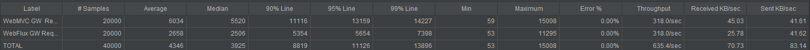
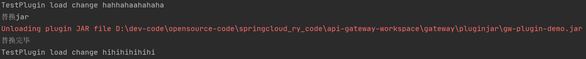
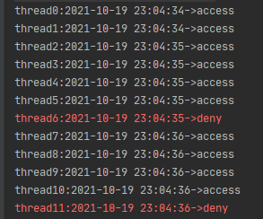

# 概述
> 记录网关研究中的一些代码片段

# 工程
- microserice-user : 一个简单的用户微服务工程
- microserice-acct : 一个简单的账号微服务工程
- flux : 应用spring-weblux栈写的转发到web服务的简易网关
- mvc : 应用spring-mvc栈写的转发到web服务的简易网关
- jmeter : jmeter测试脚本

- gw-flux ：确定webflux为开发技术栈后，在这个项目里写的一些网关功能。flux工程里只是前期用于选型使用的简易项目，保留flux便以查看。
- gw-plugin : 可扩展的api
- gw-plugin-demo : 引用gw-plugin,写自定义的扩展逻辑

## servlet3.0+springboot 简易网关
> 参考springboot-zuul,代码在`mvc`工程`rechard.learn.gw` 包里

## webflux 简易网关
> 代码在`flux`工程`rechard.learn.gw` 包里

## 为什么选webflux而不用sevlet3.0+springboot
 mvc工程TestController
 - http://localhost:9090/block/20  阻塞调用  
 - http://localhost:9090/async/20  异步调用
 
 mvc工程`rechard.learn.gw` package为servlet3.0写的简易网关转发 
 - http://localhost:9090/sample/hello/20 网关异步调用

 flux工程 
 - http://localhost:8090/reactor/20  webflux异步调用
 - http://localhost:8090/sample/hello/20  webflux网关异步调用
> note: url后面的20表示阻塞多长毫秒，模拟网关转发到后段服务的运行时间

分别运行microserice-user,flux,mvc 中的Application 启动3个项目,使用jemter运行jmeter工程里的`Flux-VS-MVC.jmx`
压测4个api在不同阻塞时间的performance  
  
模拟后端服务延迟50ms，4000thread访问5次，总计2w次。 使用webflux和mvc压测结果如下
 
  
> 由于本地电脑测试，每个开4000线程，共8000线程，所以数据不重要，重要的看对比,明显看出webflux要好  

## gw-flux 网关工程功能
> 确定以webflux为开发栈后，这个工程就是写关键功能代码片段。主要功能如下

### 路由功能
代码在 RouteFilter

### 负载均衡
代码在 RouteFilter.filter->HttpCommand.doHttpInvoke

### 熔断降级
问题：为什么需要熔断降级？

答：因为当遇到调用后端接口超时，或者异常的情况，后端服务无法立即恢复，这种情况下再将请求发到后端已没有意义。

使用Hystrix进行熔断降级处理。
代码在 RouteFilter.filter->HttpCommand.doHttpInvoke

### 日志功能
代码在 LogFilter

### 认证功能
代码在 AuthFilter

### 扩展功能
demo代码在 HotswapTest

例如自定义认证,在gw-plugin-demo工程里写自定义扩展功能，写好后打成jar包
在gw-flux里使用urlClassloader 按名字加载jar包达到可扩展的要求。

#### 如何热替换 jar

研究jsp的classloader原理发现每个jsp文件都有1个对应的classloader,该classloader会缓存起来。
当jsp文件热替换后，会清空classloader,然后建立1个新的classloader来加载。

按这个思路
当用户新写了个gw-plgin-demo.jar后，当其通过网关管理平台重新上传1个新的同名的jar后。网关会删掉classloader,达到热替换的目的。

替换的代码逻辑看 HotswapTest
 
 
### 限流功能

使用redis+lua 来做,代码RedisRateLimitTest

代码在RateLimitFilter

#### 限流功能开发中遇到的问题记录
- 1 @user_script:33: @user_script: 33: Write commands not allowed after non deterministic commands 

https://blog.csdn.net/wtyvhreal/article/details/43193591
>由于执行了local a=redis.call('TIME') 这是拥有REDIS_CMD_RANDOM属性的命令
不可以再执行拥有REDIS_CMD_WRITE属性的命令，否则会提示错误：“Write commands not  allowed after non deterministic commands.”拥有REDIS_CMD_WRITE 属性的命令
redis.call("HSET",KEYS[1],"curr_permits",local_curr_permits-1)

- 2 redis.call() 和 redis.pcall()的区别
- - 当 redis.call() 在执行命令的过程中发生错误时，脚本会停止执行，并返回一个脚本错误，错误的输出信息会说明错误造成的原因
- - 和 redis.call() 不同，redis.pcall() 出错时并不引发(raise)错误，而是返回一个带 err 域的 Lua 表(table)，用于表示错误,程序不会报错
 

- 3 lua如何调试
> print(xxx) 会在redis里打印出xxx的值

结果查看
 
> 每秒限定qps=4

## reference
- [Reactor reference documentation](https://projectreactor.io/docs/core/release/reference/index.html#mono) 

